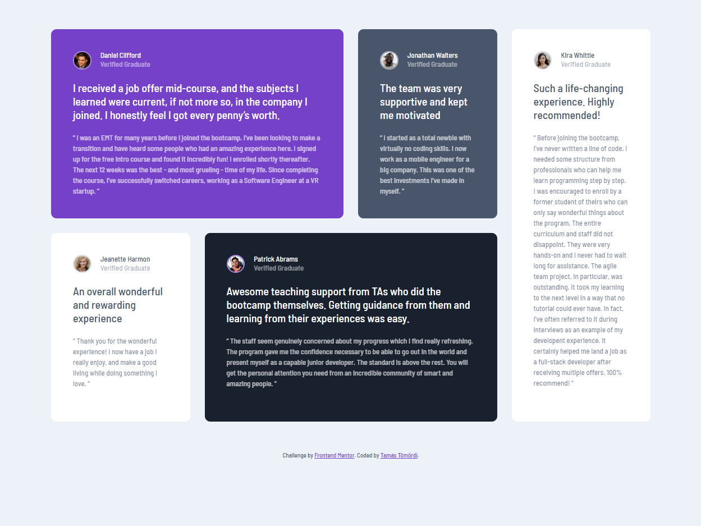

# Frontend Mentor - Testimonials grid section solution

This is a solution to the [Testimonials grid section challenge on Frontend Mentor](https://www.frontendmentor.io/challenges/testimonials-grid-section-Nnw6J7Un7). Frontend Mentor challenges help you improve your coding skills by building realistic projects. 

## Table of contents

- [Overview](#overview)
  - [The challenge](#the-challenge)
  - [Screenshot](#screenshot)
  - [Links](#links)
- [Built with](#built-with)
- [Author](#author)

## Overview

### The challenge

Users should be able to:

- View the optimal layout for the site depending on their device's screen size

### Screenshot

### Links

- [GitHub project URL](https://github.com/tamastomordi/testimonials-grid-section)
- [Live site URL](https://elegant-turing-788e30.netlify.app/)

## Built with

- Semantic HTML5 markup
- CSS custom properties
- Grid
- Mobile-first workflow
- [Modern CSS Reset](https://github.com/andy-piccalilli/modern-css-reset) by Andy Piccalilli

## Author

- Tamás Tömördi - [tomordi.com](https://www.tomordi.com)
